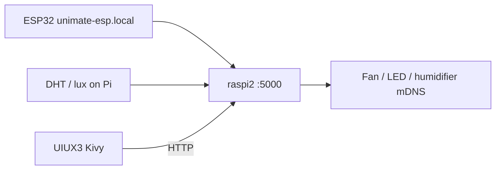

# UniMate

UniMate is a Raspberry Pi–based smart desk companion: a **Kivy** touchscreen UI, sensor bridge to an ESP32 and room hardware, optional camera live feed, and voice assistants. Most day-to-day use runs from **`UIUX3`** plus **`Wifi/raspi2.py`** (FastAPI on port **5000**).

## What runs where

| Component | Path | Role |
|-----------|------|------|
| **Bridge API** | `Wifi/raspi2.py` | Polls ESP32 + local temp/lux; controls LED strip, fan, humidifier, desk light |
| **Kivy UI** | `UIUX3/` | Full-screen HDMI app (face, study, sensors, controls) |
| **Live feed** | `Livefeed/livefeed.py` | MediaMTX WebRTC + ngrok tunnel (optional) |
| **Gemini voice** | `alexa/voiceAgent2.py` | Wake-word “Bunny” + Gemini Live (optional; separate from UI voice) |

The UI talks to the bridge at `http://127.0.0.1:5000` (override with `UNIMATE_RASPI_BRIDGE_URL`).

## Prerequisites

- **Raspberry Pi** with HDMI desktop (or `DISPLAY=:0` for the UI).
- **Python venv** at `~/unimate` (used by install scripts and recommended for all services):

  ```bash
  # If you need to create it once:
  python3 -m venv ~/unimate
  ```

- **Dependencies** (one-time, can take a while on Pi):

  ```bash
  bash /home/unimate/Unimate/Requirements/install_requirements.sh
  ```

  Failed packages are logged under `Requirements/`; use `install_requirements_resume.sh` to retry.

- **Hardware / network** (for full functionality):
  - ESP32 publishing vitals at `http://unimate-esp.local/data`
  - Smart plugs/controllers (mDNS): `smart-fan.local`, `led-controller.local`, `humidifier.local`
  - DHT + BH1750 on the Pi (via `shared_utils/TempSensor.py`, `LuxSensor.py`)
  - NeoPixel strip (via `LED/LED_Strip.py`)

- **UI-only extras** (Ask From Bunny in the dashboard):
  - `UIUX3/.env` with `OPENAI_API_KEY=...`
  - Piper TTS binaries (paths in `UIUX3/nlp_functions.py`: `~/unimate_tts/...`)

- **Live feed**: `Livefeed/mediamtx` binary and `ngrok` on `PATH`, plus an ngrok reserved domain if you use the default in `livefeed.py`.

---

## Quick start (typical session)

Run these on the Pi. Use **separate terminals** (or a process manager) so each service stays up.

### 1. Bridge API (start first)

The UI and device controls depend on this.

```bash
cd /home/unimate/Unimate/Wifi
/home/unimate/unimate/bin/uvicorn raspi2:app --host 0.0.0.0 --port 5000
```

Check: `curl http://127.0.0.1:5000/data` should return JSON (may show “Awaiting data…” until ESP32/sensors connect).

### 2. Kivy UI (HDMI)

From a session on the Pi desktop (not headless SSH without X). `run_hdmi.sh` launches `main.py` fullscreen on the HDMI display (kiosk-style, but the stack is Kivy):

```bash
cd /home/unimate/Unimate/UIUX3
chmod +x run_hdmi.sh   # once
./run_hdmi.sh
```

**Windowed debug** (smaller window, useful over SSH with X forwarding):

```bash
cd /home/unimate/Unimate/UIUX3
UNIMATE_WINDOWED=1 ./run_hdmi.sh
```

**Fresh venv only for the UI** (if Kivy is not in `~/unimate`):

```bash
cd /home/unimate/Unimate/UIUX3
python3 -m venv .venv
source .venv/bin/activate
pip install -r requirements.txt
python3 main.py
```

`run_hdmi.sh` prefers `~/nlp/bin/python3` if present; otherwise it uses system `python3`.

### 3. Live camera feed (optional)

```bash
cd /home/unimate/Unimate/Livefeed
/home/unimate/unimate/bin/python3 livefeed.py
```

Custom ngrok domain / port:

```bash
/home/unimate/unimate/bin/python3 livefeed.py --domain your-subdomain.ngrok-free.dev --port 8889
```

Stop with **Ctrl+C** (shuts down MediaMTX and ngrok).

### 4. Gemini wake-word agent (optional)

Separate from the UI’s OpenAI “Ask From Bunny” flow.

```bash
cd /home/unimate/Unimate/alexa
# Create .env with: GEMINI_API_KEY=your_key_here
/home/unimate/unimate/bin/python3 voiceAgent2.py
```

Uses the `alexa/venv` only if you installed deps there; otherwise the `~/unimate` interpreter is fine if packages are installed.

---

## Recommended startup order

```text
1. Network + ESP32 + smart devices online
2. Wifi/raspi2.py  (port 5000)
3. UIUX3/run_hdmi.sh  (Kivy UI on HDMI)
4. Livefeed/livefeed.py  (if streaming)
5. alexa/voiceAgent2.py  (if using Gemini voice)
```



---

## Environment variables

| Variable | Where | Purpose |
|----------|--------|---------|
| `UNIMATE_RASPI_BRIDGE_URL` | UI | Default `http://127.0.0.1:5000` |
| `UNIMATE_WINDOWED` | UI | `1` = windowed mode |
| `UNIMATE_DISPLAY` | UI | Force X display, e.g. `:0` |
| `DISPLAY` | UI | Set by `run_hdmi.sh` to `:0` if unset |
| `OPENAI_API_KEY` | `UIUX3/.env` | Ask From Bunny (STT + GPT + Piper) |
| `GEMINI_API_KEY` | `alexa/.env` | `voiceAgent2.py` |

Do not commit `.env` files; they are ignored by git.

---

## UI navigation (UIUX3)

Panels (swipe or arrow keys): **Study → Face → Sensors → Controls**.

- Swipe **left** = previous panel; **right** = next.
- **Esc** exits fullscreen.
- Sensors and controls call the bridge; without step 1 above, values stay mock/offline.

More UI detail: [UIUX3/README.md](UIUX3/README.md).

---

## Troubleshooting

| Symptom | Things to check |
|---------|------------------|
| UI window missing | Desktop on HDMI; `echo $DISPLAY` → `:0`; over SSH try `xhost +local:` once on the Pi |
| Sensors empty / stale | Bridge running? `curl localhost:5000/data`; ESP32 reachable at `unimate-esp.local` |
| Fan/light/humidifier no-op | mDNS hostnames resolve; bridge logs show POSTs to `/set-fan`, `/set-lights`, etc. |
| Ask Bunny fails | `UIUX3/.env` + mic; Piper paths exist; `OPENAI_API_KEY` valid |
| Live feed exits immediately | `Livefeed/mediamtx` executable; `ngrok` installed; domain flag matches your account |

---

## Repo layout (high level)

| Directory | Notes |
|-----------|--------|
| `UIUX3/` | **Current** Kivy UI |
| `UIUX4/` | Newer dev copy; not the default startup path |
| `Wifi/` | `raspi2.py` bridge; `raspi.py` is an earlier variant |
| `shared_utils/` | Temp, lux, device HTTP helpers |
| `LED/` | NeoPixel strip control |
| `Livefeed/` | MediaMTX + ngrok launcher |
| `alexa/` | Gemini live voice agent |
| `CV/`, `Motor/`, `NLP/` | Experiments and prototypes |
| `Requirements/` | Pi dependency install scripts |

---

## Development notes

- Bridge module path: run `uvicorn` from `Wifi/` so `LED/` and `shared_utils/` imports resolve.
- Temperature cache: `shared_utils/temp_data.json` (updated by the bridge’s temp loop).
- Older Tkinter UI and one-off scripts live under other folders; they are not part of the default startup path above.
